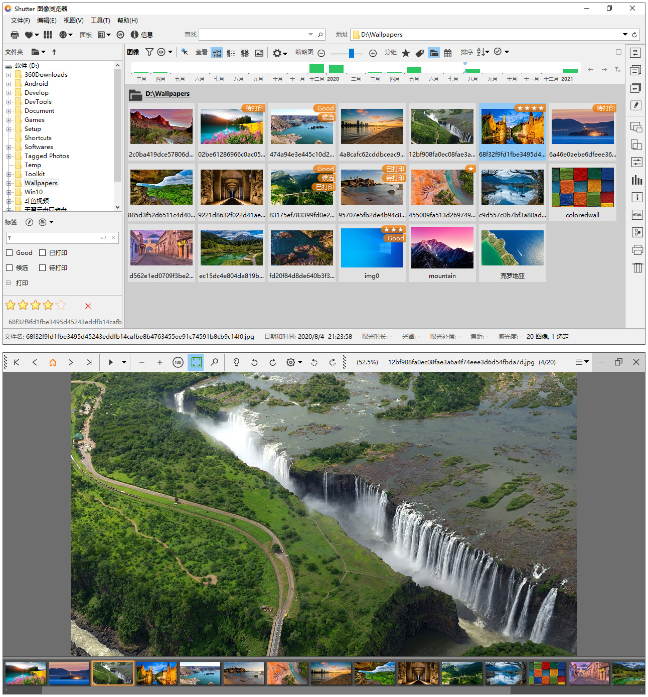

# Shutter

Shutter Image Browser and Viewer is developed from ExifPro 2.3 at https://github.com/mikekov/ExifPro.

Since there is no release for ExifPro project and it seems unactive from Feb 2018, Shutter is to make this software alive.

Fix bugs and change UI to make it looks much better.
Update all encoders and other libraries.
Optimize the settings and various enhancement.

--------------------------------------------------------------------------
Shutter is an image browser application that can help you display, describe, tag, manage and manipulate your collection of images/photographs.

Viewer window provides zooming and panning, image color and aspect correction, light table, and a slide show.

